# Firebase Chat WP

A **one-to-one Firebase chat system** designed for seamless integration with **WordPress using PHP**.  
Although optimized for WordPress developers, the same coding structure can be adapted to other frameworks such as **React, Laravel, or even custom PHP applications**.

---
## 🚀 Features
- One-to-one chat system using **Firebase Realtime Database**
- Simple integration with **WordPress themes/plugins**
- Extendable to any framework (React, Laravel, custom PHP, etc.)
- Easy setup with Firebase credentials
- Real-time message syncing
---

## 📂 Core File

`templates/tpl-chat.php`

This is the primary coding file that powers the chat system.  
By customizing this file, you can easily extend or integrate the chat system into different platforms.

---

## ⚙️ Configuration

All you need to do is update your Firebase credentials inside:

```javascript
const firebaseConfig = {
  // your firebase credentials
};
```

## 📝 Setup Steps

1. **Open Firebase Console**  
   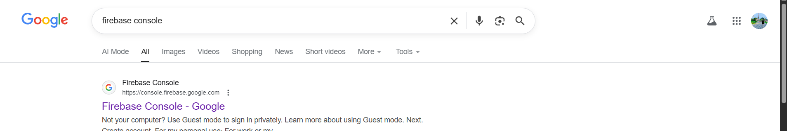

2. **Create a New Project**  
   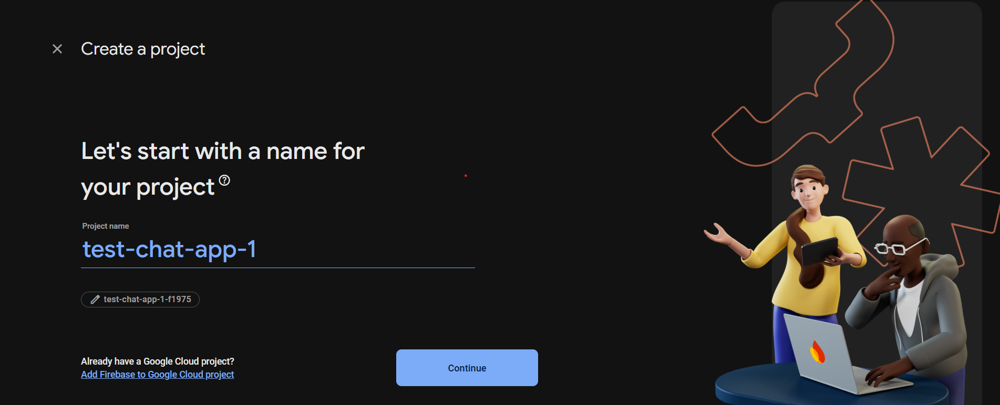

3. **Access Your Firebase Project Dashboard**  
   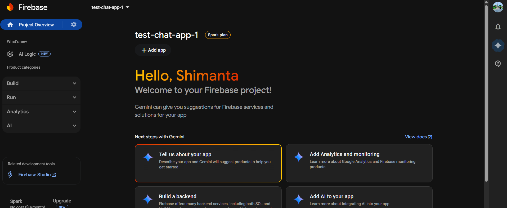

4. **Create Realtime Database**  
   - Go to **Build > Realtime Database**  
   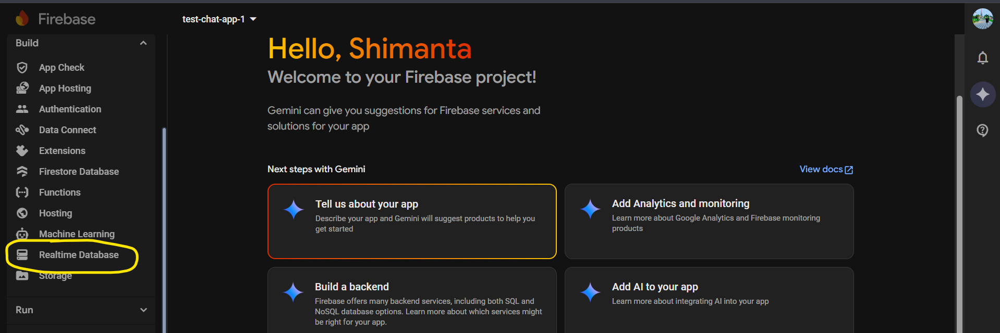

5. **Select Your Preferred Database Region**  
   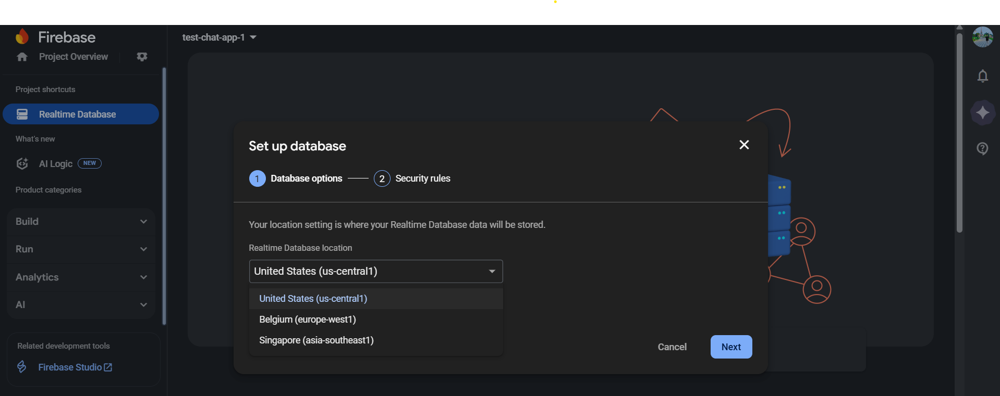

6. **Start in Locked Mode**  
   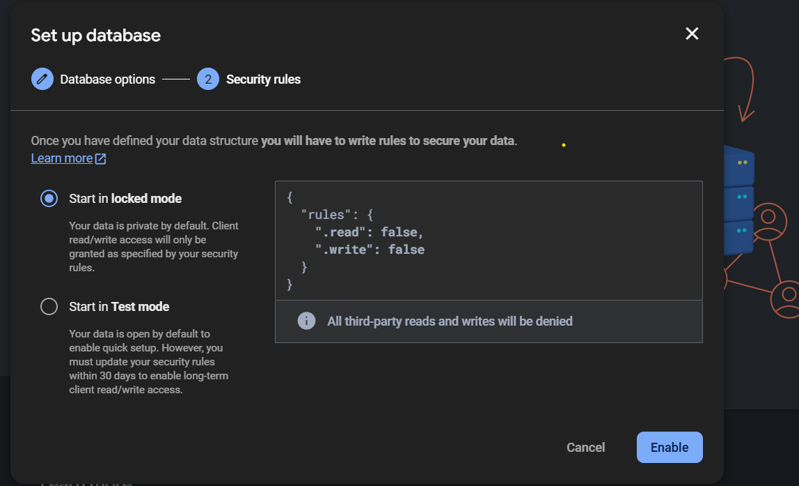

7. **Set Database Rules**  
   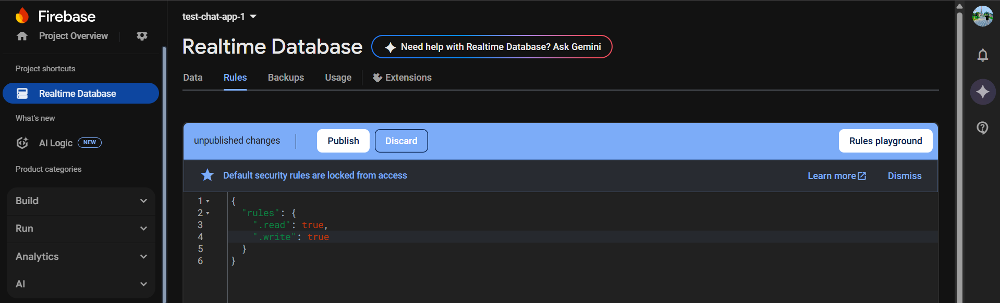

8. **Go to Project Settings → Create a Web App**  
   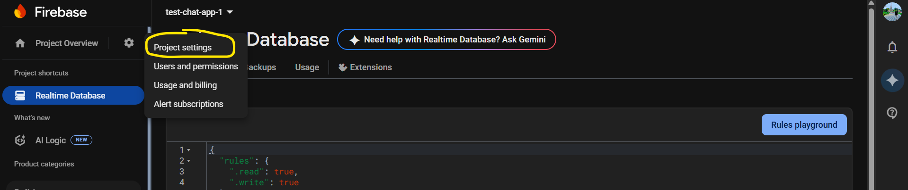

9. **Enter Your App Name & Select Firebase Hosting**  
   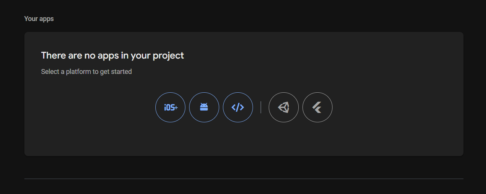

10. **Copy Firebase Config Credentials. Replace the existing ones in tpl-chat.php**  
    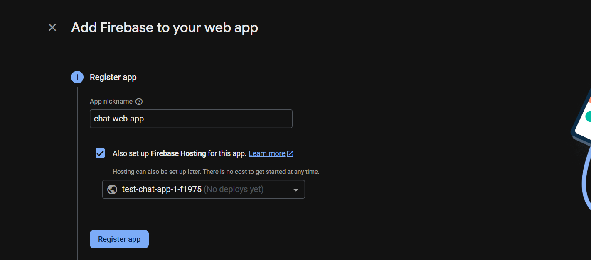

11. **🎉 Done! Now when you start chatting, messages will appear in your Realtime Database.**  
    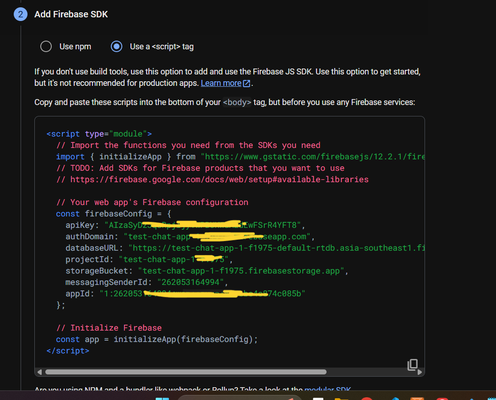


## 📌 Notes

- This project is meant for **learning/demo purposes**.  
- For production apps, make sure to **secure your Firebase rules**.  
- Extend and customize as needed for your own framework.  

## 👉 My Social Media Links

- 🤹‍♂️ **LinkedIn**: [Shimanta Das](https://www.linkedin.com/in/shimanta-das-497167223)  
- 👹 **Facebook**: [Shimanta Das FB](https://www.facebook.com/profile.php?id=100078406112813)  
- 📸 **Instagram**: [@meshimanta](https://www.instagram.com/meshimanta/?hl=en)  
- 🐦 **Twitter**: [@Shimantadas247](https://mobile.twitter.com/Shimantadas247)  
- 📬 **Telegram**: [Microcodes Official](https://t.me/microcodesofficial)  
- 🎦 **YouTube**: [microcodes](https://youtube.com/channel/UCrbf6B0CU9x-I4bQOYbJVGw)  
